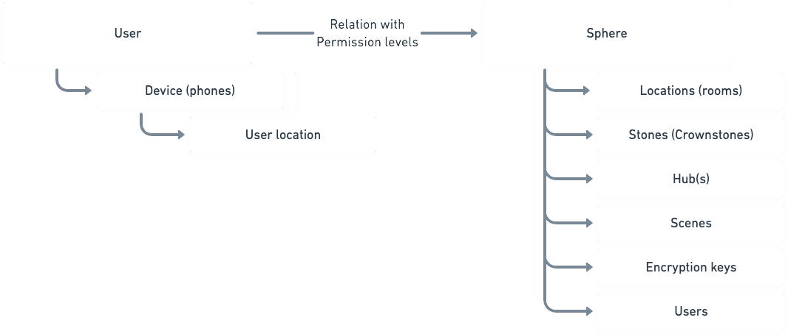

# Data Hierarchy

A user has devices (phones, tablets etc). These devices can get a location from the indoor localization.

A user can be tied to a Sphere. A Sphere is a collection of Crownstones, joined by shared encryption keys. The Sphere also contains references to it's users,
as well as rooms, scenes, hubs and other supporting models.
