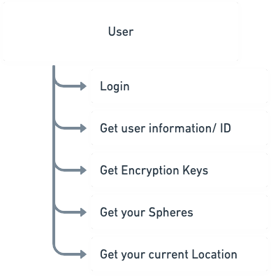
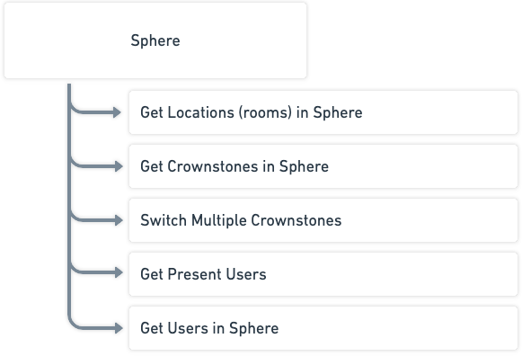
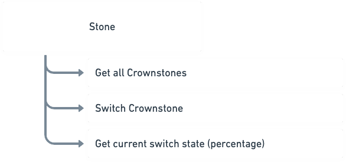

# REST API

## Explorer

You can take a look at all the available endpoints here:

[https://my.crownstone.rocks/explorer](https://my.crownstone.rocks/explorer)

Paste your access token in the box in the top right corner to authorize yourself and have fun!

## {id} notation
Many models depend on having the id of the model provided in the path.

The id will always require the ID of the corresponding model, so the `/users/{id}/*` requires the userId, `/Spheres/{id}/*` requires the sphereId etc.

This will look like this:
```
https://my.crownstone.rocks/api/users/{id}/spheres

https://my.crownstone.rocks/api/users/58dcd2d7abc2e8c330b5fd64/spheres
```


# Controllers & Endpoints

The API is divided up into multiple controllers. These represent datamodels or collections of endpoints.
The documentation of the REST api will not cover all endpoints. Some are legacy, some are for app-specific usecases, and some are for
internal use. This documentation is written to cover most usecases an external developer might have and to guide them to the right endpoints.
If you have a usecase that is not covered by this documentation, please contact us and we'll update it!

In order to make the documentation a bit more readable, the prefix `https://cloud.crownstone.rocks/api` is removed from the endpoint descriptions.
Using any endpoint can be done by adding the endpoint to the prefix like `https://cloud.crownstone.rocks/api/users/me`.

We will now handle the 3 controllers which should be able to take care of all your requirements.

## user

The user represents your account. It is the startingpoint to start using the Crownstone cloud.

You can use the user models for the following things:



[You can find the endpoints that you need for this here](./models/USERS.md)


## Sphere

Your Sphere represents your house, office, or any collection of Crownstones which share a set of encryption keys. It is strongly recommended NOT to have
sphers overlapping. If you use multiple spheres in the same house (or if your phone can see multiple spheres from a given position), this will lead to
unintended side effects.

Your sphere is the source connecting users, rooms (locations), Crownstones, hubs, messages, scenes and more together. A users is given access to the
underlying resources based on their accesslevel in the Sphere.

You can use the sphere model for the following things:



[You can find the endpoints that you need for this here](./models/SPHERES.md)


## Stone

A Stone is a Crownstone of any type. It can be a built-in, a plug, a guidestone, a dongle, etc. The Stone model keeps track of the current switch state
of a Crownstone (so whether it is on or off) and you can switch them here as well.

If you want to switch many Crownstones at once, it might be better to use the Sphere model.

You can use the stone model for the following things:



[You can find the endpoints that you need for this here](./models/STONES.md)


## What about the rest?

There are a lot of endpoint here but I think these are probably all you need. If these do not cover your usecases, please let us know so we can improve
our documentation!

## Legacy data

It could be you get more fields in a response than we have described here. These are most likely there for legacy reasons and can be ignored.


## Data structure

[There's a small overview on how the data hierarchy is defined here.](./DATA_HIERARCHY.md)
